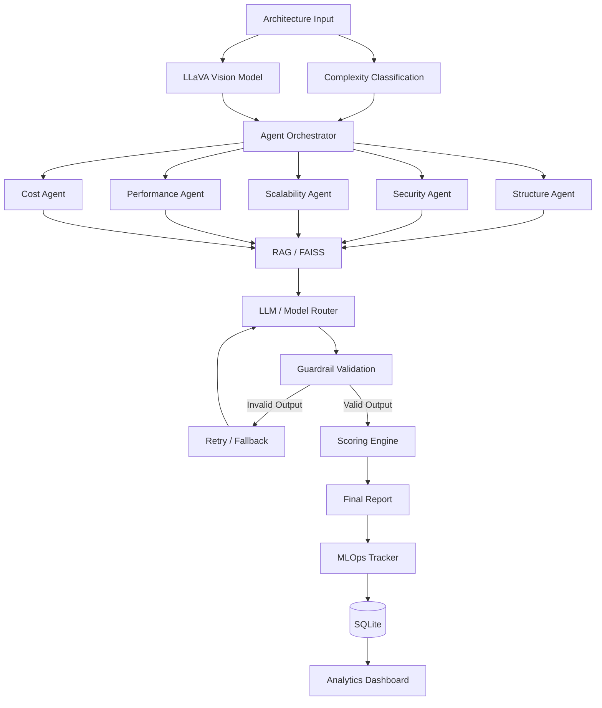

how hard it is to give it like the prev like i am agi giving you # ArchLens – Multi-Agent System Architecture Evaluator

ArchLens is a multi-agent AI system that evaluates software architectures across five engineering dimensions:

* Structure
* Security
* Scalability
* Performance
* Cost

It supports both **text-based architecture evaluation** and **diagram/image-based evaluation using LLaVA**.

The goal is to turn an architecture description or diagram into a structured engineering review with scores, issues, recommendations, and an overall architecture score.

# Problem

Architecture reviews are usually manual and depend heavily on the experience of the reviewer.

A system may look reasonable at a high level but still have problems such as:

* Missing components or unclear service boundaries
* Security weaknesses
* Scalability bottlenecks
* Performance risks
* Unnecessary infrastructure cost

ArchLens automates this review by splitting the evaluation into multiple specialized agents instead of asking a single LLM to evaluate everything.

# Architecture



# How It Works

## 1. Architecture Input

The user can provide an architecture description for evaluation.

ArchLens can also work with an architecture diagram/image.

For image-based evaluation, the diagram is processed using **LLaVA running locally through Ollama**.

```text
Text Input
    ↓
Architecture Evaluation

Diagram/Image
    ↓
LLaVA
    ↓
Architecture Information
    ↓
Architecture Evaluation
```

## 2. Complexity Classification

The architecture is first classified based on its complexity.

The classification determines how the system routes model requests.

```text
Simple / Medium
       ↓
Ollama
       ↓
Local Mistral

Complex
       ↓
OpenRouter
       ↓
Configured Cloud Model
```

Fallback mechanisms are available when a selected model fails.

## 3. Five Specialized Agents

ArchLens uses five independent evaluation agents.

### Structure Agent

Checks:

* Component organization
* Service boundaries
* Communication patterns
* Architectural clarity

### Security Agent

Checks:

* Authentication and authorization
* Data protection
* Attack surfaces
* Security controls

### Scalability Agent

Checks:

* Horizontal scaling
* Bottlenecks
* Load handling
* Service scalability

### Performance Agent

Checks:

* Latency
* Throughput
* Database access
* Caching
* Processing bottlenecks

### Cost Agent

Checks:

* Infrastructure usage
* Unnecessary services
* Resource consumption
* Potential cost optimization

## 4. Concurrent Agent Execution

The five agents are executed concurrently using Python's `ThreadPoolExecutor`.

Instead of waiting for each agent sequentially:

```text
Structure
Security
Scalability
Performance
Cost
```

the system runs the agent evaluations concurrently.

Each agent independently goes through the retrieval, model routing, validation, and scoring pipeline.

This reduces unnecessary waiting when multiple independent evaluations are required.

## 5. RAG and FAISS

ArchLens uses a knowledge base containing architecture best practices.

The knowledge base is indexed using **FAISS**, with embeddings generated using Hugging Face/SentenceTransformers.

During evaluation:

```text
Agent Query
    ↓
Embedding
    ↓
FAISS Retrieval
    ↓
Relevant Best Practices
    ↓
LLM
    ↓
Evaluation
```

The retrieved context helps the agents ground their recommendations in predefined architectural practices instead of relying entirely on model-generated reasoning.

## 6. LLM Routing

ArchLens supports different model providers depending on the evaluation requirements.

### Local Models

Ollama is used for local inference.

Current local models include:

* Mistral
* LLaVA for image/diagram analysis

### OpenRouter

OpenRouter is used for cloud-based model inference, particularly for more complex evaluations.

The router also supports:

* Multiple OpenRouter models
* Retry logic
* Timeouts
* Fallback models
* Ollama fallback

The actual model used during an evaluation is tracked by the MLOps system.

## 7. Guardrails

LLM responses are validated before they are accepted by the evaluation pipeline.

The expected output contains:

```text
score
issues
recommendations
summary
```

The guardrail checks:

* Output type
* Score range
* Required fields
* Issue structure
* Severity values
* Recommendation validity
* Summary validity

If the model produces invalid output, the system retries the request instead of passing malformed data to the scoring system.

## 8. Scoring

Each agent produces a score between 0 and 10.

The scoring engine combines the five dimensions into a final architecture score.

```text
Structure
Security
Scalability
Performance
Cost
       ↓
Weighted Scoring
       ↓
Final Score
```

The final result includes the individual dimension scores and overall architecture assessment.

## 9. MLOps Tracking

ArchLens tracks evaluation information using SQLite.

The system records information such as:

* Evaluation timestamp
* Architecture complexity
* Model used
* Agent latency
* Agent success
* JSON validity
* Dimension scores
* Final score
* Errors
* Hallucination-related flags

This makes it possible to analyze how the evaluation system behaves over time.

## 10. Analytics Dashboard

The Streamlit analytics dashboard provides visibility into system performance.

It includes:

* System health metrics
* Evaluation score trends
* Complexity distribution
* Model usage
* Quality metrics
* Recent evaluations
* Evaluation history

The dashboard uses Plotly for visualization.

# Image / Diagram Evaluation

ArchLens also supports architecture diagrams.

The current image evaluation pipeline uses **LLaVA locally through Ollama**.

```text
Architecture Diagram
        ↓
      LLaVA
        ↓
Visual Architecture Understanding
        ↓
Architecture Information
        ↓
Five-Agent Evaluation
        ↓
Scoring + Report
```

This allows ArchLens to evaluate an architecture even when the information is primarily represented visually rather than as text.

The local LLaVA setup is currently intended for development/local execution.

# Problems Faced During Development

## RAG Model Initialization

The retriever initially encountered errors where the embedding model was not initialized correctly:

```text
'NoneType' object has no attribute 'encode'
```

This was fixed by introducing controlled lazy initialization, validation, and safer shared model/index handling.

## Invalid LLM Responses

LLMs occasionally returned malformed or unexpected JSON.

The solution was to introduce strict schema validation and retry logic before accepting an agent result.

## Model Attribution During Concurrent Execution

Because the five agents run concurrently, tracking which model actually produced each result required explicit per-agent model tracking.

The orchestrator now records the actual model used by each agent.

## OpenRouter Failures

Cloud model requests can fail because of timeouts, API errors, or malformed responses.

The router now includes:

* Request timeouts
* Retries
* Retry delays
* Multiple configured models
* Local Ollama fallback

## SQLite Analytics

The analytics system initially encountered errors caused by positional tuple access when the database query structure changed.

The database layer was updated to use SQLite `Row` objects and named columns, making the analytics code more reliable.

# Project Structure

```text
Archlens-multi-agent-system-architecture-evaluator/
│
├── agents/
│   └── orchestrator.py
│
├── core/
│   ├── guardrail.py
│   ├── knowledge_base.py
│   ├── mlops.py
│   ├── models.py
│   ├── prompts.py
│   ├── retriever.py
│   ├── router.py
│   └── scoring.py
│
├── data/
│   ├── best_practices/
│   └── faiss_index/
│
├── mcp_server/
│
├── pages/
│   └── analytics.py
│
├── tests/
│
├── .devcontainer/
│
├── .env.example
├── .gitignore
├── README.md
├── app.py
└── requirements.txt
```

# Tech Stack

| Component         | Technology                              |
| ----------------- | --------------------------------------- |
| Language          | Python                                  |
| UI                | Streamlit                               |
| Agents            | Custom Python multi-agent orchestration |
| Agent Concurrency | ThreadPoolExecutor                      |
| Local LLM         | Ollama + Mistral                        |
| Vision Model      | LLaVA + Ollama                          |
| Cloud LLM         | OpenRouter                              |
| RAG               | FAISS                                   |
| Embeddings        | Hugging Face / SentenceTransformers     |
| Guardrails        | Custom schema validation + retry        |
| Scoring           | Custom weighted scoring engine          |
| MLOps             | SQLite                                  |
| Analytics         | Plotly + Streamlit                      |

# Local Setup

## 1. Clone the repository

```bash
git clone https://github.com/anishsharma251205-bit/Archlens-multi-agent-system-architecture-evaluator-.git

cd Archlens-multi-agent-system-architecture-evaluator-
```

## 2. Create a virtual environment

```bash
python -m venv venv
```

Activate it:

### Windows

```bash
venv\Scripts\activate
```

### Linux / macOS

```bash
source venv/bin/activate
```

## 3. Install dependencies

```bash
pip install -r requirements.txt
```

## 4. Configure environment variables

Create a `.env` file based on `.env.example`.

Configure the required OpenRouter settings if cloud inference is being used.

## 5. Install Ollama

Install Ollama and pull the models used locally.

For example:

```bash
ollama pull mistral
ollama pull llava
```

The exact model configuration can be controlled through the project's environment/model configuration.

## 6. Run ArchLens

```bash
streamlit run app.py
```

# Current Implementation

ArchLens currently includes:

* Multi-agent architecture evaluation
* Five specialized evaluation agents
* Concurrent agent execution
* RAG with FAISS
* Hugging Face embeddings
* Local Mistral inference through Ollama
* LLaVA-based image/diagram evaluation through Ollama
* OpenRouter cloud inference
* Model fallback and retry mechanisms
* Structured LLM output validation
* Guardrails
* Weighted architecture scoring
* SQLite-based MLOps tracking
* Streamlit analytics dashboard
* Plotly visualizations
* Evaluation history tracking

# Author

**Anish Sharma**

