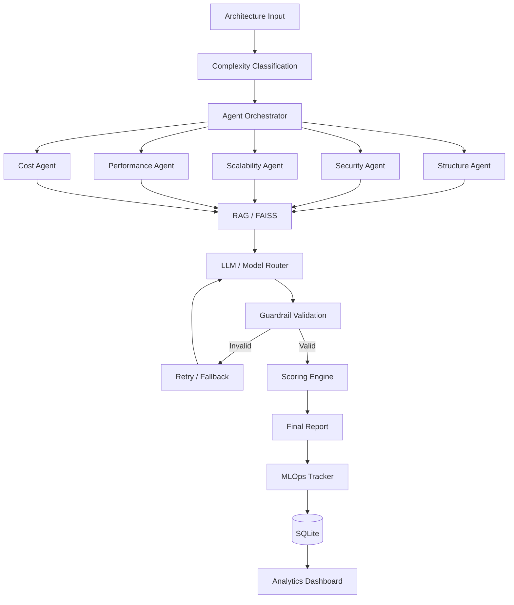

# ArchLens

## Multi-Agent AI System Architecture Evaluator

ArchLens is an AI-powered system that evaluates software architectures across five engineering dimensions:

* Structure
* Security
* Scalability
* Performance
* Cost

Instead of relying on a single LLM response, ArchLens uses five specialized agents that evaluate different parts of an architecture concurrently. Their results are validated, scored, tracked, and combined into a final architecture report.

---

# Problem

Architecture reviews require reasoning about multiple engineering concerns at the same time.

A system can be well designed from a structural perspective while still having:

* Security vulnerabilities
* Database bottlenecks
* Single points of failure
* Poor scaling strategies
* Performance issues
* Unnecessary infrastructure costs

ArchLens attempts to automate the initial architecture review by separating these concerns into specialized agents.

---

# Architecture



---

# How the System Works

## 1. Architecture Input

The user provides a description of the system architecture.

For example:

```text
A video streaming platform using:

React
Flutter
Node.js microservices
Kubernetes
AWS
PostgreSQL
MongoDB
Redis
Kafka
CloudFront
S3
Elasticsearch
```

ArchLens first determines the approximate complexity of the architecture.

---

## 2. Model Routing

The router chooses the appropriate inference path based on the architecture complexity.

```text
Simple / Medium
       |
       v
    Ollama
       |
       v
 Local inference


Complex
       |
       v
  OpenRouter
       |
       v
External model
```

If an external model fails, ArchLens can retry and fall back to another model or local Ollama inference.

The actual model used is recorded in MLOps.

---

# 3. Multi-Agent Evaluation

The architecture is divided into five evaluation dimensions.

### Structure Agent

Evaluates:

* Service boundaries
* Coupling
* Responsibilities
* Communication patterns
* Overall organization

### Security Agent

Evaluates:

* Authentication
* Authorization
* Secrets management
* Encryption
* IAM
* Rate limiting
* Network security

### Scalability Agent

Evaluates:

* Horizontal scaling
* Database scaling
* Caching
* Load balancing
* Queues
* Single points of failure

### Performance Agent

Evaluates:

* Latency
* Database bottlenecks
* Network overhead
* Caching
* CDN usage
* Resource utilization

### Cost Agent

Evaluates:

* Compute resources
* Storage
* Network usage
* Infrastructure choices
* Potential over-provisioning

---

# 4. Concurrent Agent Execution

The five agents are not executed sequentially.

A sequential approach would look like:

```text
Structure
   |
Security
   |
Scalability
   |
Performance
   |
Cost
```

ArchLens instead uses concurrent execution:

```text
                    +-- Structure Agent ----+
                    |                       |
                    +-- Security Agent -----+
                    |                       |
Architecture -------+-- Scalability Agent --+----> Results
                    |                       |
                    +-- Performance Agent --+
                    |                       |
                    +-- Cost Agent ---------+
```

The orchestrator uses Python's `ThreadPoolExecutor` to execute the five evaluation tasks concurrently.

Each agent independently performs:

```text
Agent
  |
Build Prompt
  |
Retrieve Context
  |
Route to Model
  |
Validate Response
  |
Return Result
```

This allows different agents to use different models when required.

For example:

```text
Structure Agent    -> Ollama
Security Agent     -> OpenRouter
Scalability Agent  -> OpenRouter
Performance Agent  -> Ollama
Cost Agent         -> OpenRouter
```

The model used by each agent is tracked separately.

---

# 5. RAG with FAISS

ArchLens uses a retrieval layer containing architecture best practices.

```text
Agent Query
    |
Embedding Model
    |
FAISS Search
    |
Relevant Architecture Knowledge
    |
LLM
```

The retrieval system uses:

* Hugging Face embeddings
* Sentence Transformers
* FAISS

This provides relevant architectural context to the agents before they generate their evaluation.

---

# 6. Guardrails

LLM responses are not always returned in the expected format.

During development, malformed JSON and missing fields caused downstream scoring failures.

ArchLens therefore validates every agent response before processing it.

The guardrail checks:

* JSON structure
* Score range
* Issue format
* Recommendation format
* Severity
* Summary

If the response is invalid, the system retries the model with a corrective prompt.

```text
LLM
 |
Validate
 |
 +---- Valid ------> Scoring
 |
 Invalid
 |
Retry
```

---

# 7. Scoring

Each agent produces a score between `0` and `10`.

The scoring engine combines the five dimensions into a final architecture score.

```text
Structure
Security
Scalability
Performance
Cost
      |
      v
Weighted Scoring
      |
      v
Final Score / 10
```

Scoring is kept separate from LLM-generated explanations so that the evaluation logic remains deterministic.

---

# 8. MLOps

ArchLens also tracks the performance of its own AI pipeline.

The system records:

* Model used
* Architecture complexity
* Total latency
* Agent latency
* Agent success
* JSON validity
* Individual scores
* Final score
* JSON failures
* Hallucination flags

The data is stored locally using SQLite.

```text
Evaluation
    |
MLOps Tracker
    |
SQLite
    |
Analytics
```

The runtime database is excluded from Git using `.gitignore`.

---

# 9. Analytics

The Streamlit analytics dashboard provides visibility into previous evaluations and system behaviour.

It currently tracks:

* Total evaluations
* Average latency
* JSON failure rate
* Mean score
* Accuracy
* Score deviation
* MAE
* Model usage
* Complexity distribution
* Score trends
* Evaluation history

The analytics system was also used during development to identify failures in the evaluation pipeline.

---

# Problems We Faced

Building ArchLens involved several engineering problems beyond simply connecting an LLM to the application.

## RAG Initialization

Some agents initially reached the retrieval layer before the embedding model was available.

This caused:

```text
'NoneType' object has no attribute 'encode'
```

We fixed this by implementing controlled lazy initialization and validation for the FAISS index, chunks, and embedding model.

---

## Malformed LLM Output

Models occasionally returned invalid JSON or incomplete structures.

Examples included:

* Missing fields
* Invalid score types
* Empty recommendations
* Unexpected JSON structures

We introduced strict validation and retry logic so invalid responses do not reach the scoring layer.

---

## Concurrent Model Attribution

Because five agents execute concurrently, model information could be incorrectly associated with agent logs.

We changed the orchestration logic so each agent keeps track of the actual model used before writing its MLOps entry.

---

## OpenRouter Failures

External model requests can fail because of timeouts, API errors, rate limits, or invalid responses.

We added:

* Request timeouts
* Retries
* Multiple model options
* Ollama fallback

This makes the pipeline more resilient to individual model failures.

---

## SQLite Analytics Bug

While expanding the analytics dashboard, the database query structure and Python tuple indexing became inconsistent, resulting in:

```text
IndexError: tuple index out of range
```

The original analytics implementation also displayed only the latest ten evaluations.

We changed the database access to use SQLite `Row` objects and named columns, allowing the analytics layer to reliably access the complete evaluation history.

---

# Project Structure

```text
ArchLens/
|
├── agents/
│   └── orchestrator.py
│
├── core/
│   ├── guardrail.py
│   ├── knowledge_base.py
│   ├── mlops.py
│   ├── models.py
│   ├── prompts.py
│   ├── retriever.py
│   ├── router.py
│   └── scoring.py
│
├── data/
│   ├── best_practices/
│   └── faiss_index/
│
├── mcp_server/
│
├── pages/
│   └── analytics.py
│
├── tests/
│
├── .devcontainer/
├── .env.example
├── .gitignore
├── app.py
├── requirements.txt
└── README.md
```

---

# Tech Stack

```text
Python
Streamlit
Ollama
OpenRouter
Hugging Face
Sentence Transformers
FAISS
SQLite
Plotly
```

---

# Running Locally

## Clone

```bash
git clone https://github.com/anishsharma251205-bit/Archlens-multi-agent-system-architecture-evaluator-.git

cd Archlens-multi-agent-system-architecture-evaluator-
```

## Create virtual environment

### Windows

```bash
python -m venv venv
venv\Scripts\activate
```

### Linux / macOS

```bash
python3 -m venv venv
source venv/bin/activate
```

## Install dependencies

```bash
pip install -r requirements.txt
```

## Configure environment

Copy `.env.example` to `.env` and add the required API configuration.

Do not commit `.env`.

## Run

```bash
streamlit run app.py
```

Ollama should be running locally when using local model inference.

---

# Current Implementation

ArchLens currently includes:

* Five specialized architecture evaluation agents
* Concurrent agent execution
* Complexity-based model routing
* Ollama local inference
* OpenRouter integration
* Model fallback
* FAISS-based retrieval
* Hugging Face embeddings
* Structured output validation
* Guardrail retries
* Weighted scoring
* SQLite MLOps tracking
* Agent-level logging
* Streamlit analytics

---

# Author

## Anish Sharma

B.Tech Computer Science Engineering

GitHub: `anishsharma251205-bit`
