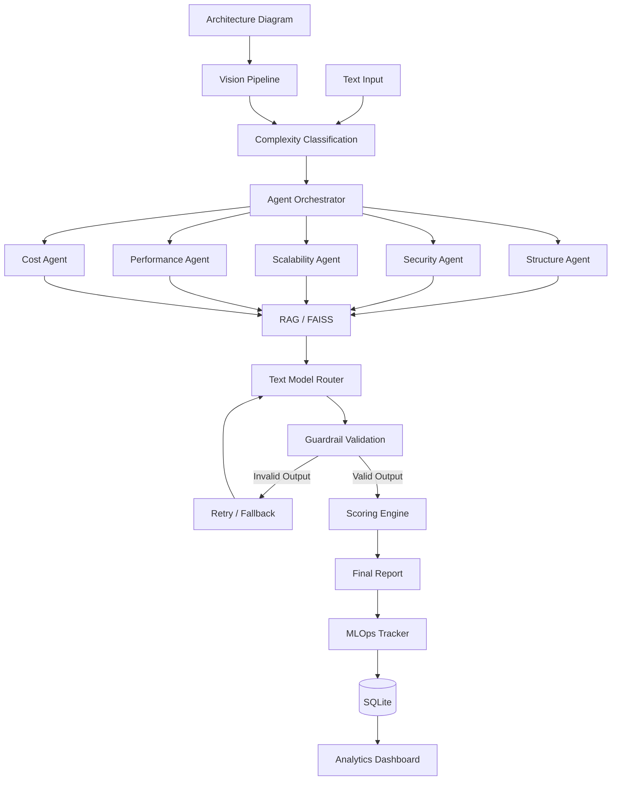

# ArchLens – Multi-Agent System Architecture Evaluator

ArchLens is a multi-agent AI system that evaluates software architectures across five engineering dimensions:

- Structure
- Security
- Scalability
- Performance
- Cost

It supports both **text-based architecture evaluation** and **diagram/image-based evaluation** using a dedicated vision pipeline (local LLaVA, or an OpenRouter vision model pool with fallback for cloud deployment).

The goal is to turn an architecture description or diagram into a structured engineering review with scores, issues, recommendations, and an overall architecture score.

## Problem

Architecture reviews are usually manual and depend heavily on the experience of the reviewer.

A system may look reasonable at a high level but still have problems such as:

- Missing components or unclear service boundaries
- Security weaknesses
- Scalability bottlenecks
- Performance risks
- Unnecessary infrastructure cost
- Poor observability
- Database resilience issues

ArchLens automates this review by splitting the evaluation into multiple specialized agents instead of asking a single LLM to evaluate everything.

## Architecture



## How It Works

### 1. Architecture Input

The user can provide an architecture description as text for evaluation.

ArchLens can also work with an architecture diagram or image, which is processed through the LLaVA vision pipeline before evaluation.

For text-based input:

```text
Text Input
    |
    v
Complexity Classification
    |
    v
Multi-Agent Evaluation
```

For diagram-based input:

```text
Architecture Diagram
    |
    v
Vision Pipeline
    |
    v
Architecture Information
    |
    v
Complexity Classification
    |
    v
Multi-Agent Evaluation
```

The two input paths eventually converge into the same multi-agent evaluation pipeline.

### 2. Complexity Classification

The architecture is first classified based on its complexity.

The classification determines how text-model requests are routed.

```text
Simple / Medium
       |
       v
Ollama
       |
       v
Local Mistral
```

```text
Complex
       |
       v
OpenRouter
       |
       v
Configured Cloud Model
```

Fallback mechanisms are available when a selected model fails.

### 3. Vision and Diagram Processing (LLaVA + OpenRouter Vision Pool)

ArchLens includes a dedicated vision pipeline for architecture diagrams. It supports both a local multimodal model (**LLaVA**) and a cloud pool of vision models through **OpenRouter**.

The vision pipeline is kept separate from the text-agent routing system because diagram understanding requires a multimodal model, while the five engineering agents primarily perform text-based architecture reasoning. Both vision paths are responsible only for interpreting the visual architecture and converting the diagram into architecture information — the actual engineering evaluation still happens downstream in the five specialized agents.

**Local: LLaVA through Ollama**

```text
Architecture Diagram
        |
        v
       LLaVA
        |
        v
Ollama Local Inference
        |
        v
Visual Architecture Understanding
        |
        v
Architecture Description
        |
        v
Five-Agent Evaluation
```

**Cloud: OpenRouter Vision Pool**

For cloud deployment, ArchLens uses a dedicated OpenRouter vision-model pool, intentionally kept separate from the text/agent model pool so vision models can be configured, monitored, and replaced independently.

```text
Architecture Diagram
        |
        v
Dedicated Vision Router
        |
        v
OpenRouter Vision Model Pool
        |
        v
Architecture Description
        |
        v
Five-Agent Evaluation
```

**Vision Model Fallback**

Just like the text-agent router, the vision router attempts its configured models sequentially and falls back on failure:

```text
Architecture Diagram
        |
        v
Vision Model 1
        |
        +---- Success ----> Architecture Description
        |
        +---- Failure
                |
                v
        Vision Model 2
                |
                +---- Success ----> Architecture Description
                |
                +---- Failure
                        |
                        v
                Vision Model 3
                        |
                        v
                     Success
                        |
                        v
              Architecture Description
```

This provides resilience against:

- Provider rate limits
- Temporary provider failures
- API errors
- Model availability issues
- Failed vision requests

During testing, the first two configured OpenRouter vision models returned upstream 429 rate-limit responses. ArchLens automatically moved to the next configured vision model, and the third vision model successfully processed the architecture diagram — allowing the evaluation to continue even when an individual vision provider or model is temporarily unavailable.

The local LLaVA setup is generally used for development and local execution, while the OpenRouter vision pool with fallback is used for cloud deployment. Either path feeds the same downstream pipeline (complexity classification, agents, scoring), since everything downstream always receives the same intermediate "architecture description" text regardless of source.

### 4. Text and Vision Model Routing

ArchLens keeps its text/agent routing and its vision (LLaVA) routing as two separate concerns, so each can be configured and swapped independently.

**Text and Agent Routing**

```text
Architecture Text
       |
       v
Complexity Classification
       |
       v
Text Model Router
       |
       +---- Simple / Medium ----> Ollama (Mistral)
       |
       +---- Complex ------------> OpenRouter
       |
       v
Five Evaluation Agents
```

**Vision Routing**

```text
Architecture Diagram
       |
       v
Vision Model Router
       |
       +---- Local ----> Ollama + LLaVA
       |
       +---- Cloud ----> OpenRouter Vision Pool (with fallback chain)
       |
       v
Architecture Description
       |
       v
Text Evaluation Pipeline
```

This separation means the vision path (LLaVA locally, or the OpenRouter vision pool with its own fallback chain in the cloud) can be developed, monitored, and upgraded independently of the Mistral/OpenRouter text-agent routing.

### 5. Five Specialized Agents

ArchLens uses five independent evaluation agents.

**Structure Agent**

Checks:

- Component organization
- Service boundaries
- Communication patterns
- Architectural clarity
- Overall system organization

**Security Agent**

Checks:

- Authentication
- Authorization
- Data protection
- Attack surfaces
- Security controls
- Security weaknesses

**Scalability Agent**

Checks:

- Horizontal scaling
- Bottlenecks
- Load handling
- Service scalability
- Scaling strategies

**Performance Agent**

Checks:

- Latency
- Throughput
- Database access
- Caching
- Processing bottlenecks
- Performance risks

**Cost Agent**

Checks:

- Infrastructure usage
- Unnecessary services
- Resource consumption
- Infrastructure efficiency
- Potential cost optimization

### 6. Concurrent Agent Execution

The five agents are executed concurrently using Python's `ThreadPoolExecutor`.

Instead of waiting for each agent sequentially:

```text
Structure
Security
Scalability
Performance
Cost
```

the system runs the independent agent evaluations concurrently.

```text
                 Agent Orchestrator
                        |
        +---------------+---------------+
        |       |       |       |       |
        v       v       v       v       v
    Structure Security Scale Performance Cost
        |       |       |       |       |
        +-------+-------+-------+-------+
                        |
                        v
                  Scoring Engine
```

Each agent independently goes through the retrieval, model routing, validation, and scoring pipeline.

Concurrent execution reduces unnecessary waiting when multiple independent evaluations are required.

### 7. RAG and FAISS

ArchLens uses a knowledge base containing architecture best practices.

The knowledge base is indexed using **FAISS**, with embeddings generated using Hugging Face and SentenceTransformers.

During evaluation:

```text
Agent Query
    |
    v
Embedding Generation
    |
    v
FAISS Retrieval
    |
    v
Relevant Best Practices
    |
    v
LLM
    |
    v
Evaluation
```

The retrieved context helps the agents ground their recommendations in predefined architectural practices instead of relying entirely on model-generated reasoning.

### 8. LLM Routing

ArchLens supports different model providers depending on the evaluation requirements — one path for the text-reasoning agents, and one path for vision/diagram understanding.

**Local Models**

Ollama is used for local inference. Current local models include:

- **Mistral** for text-based architecture evaluation
- **LLaVA** for image and diagram analysis

**OpenRouter**

OpenRouter is used for cloud-based model inference, both for more complex text evaluations and for cloud-based vision processing.

The routing system supports:

- Multiple OpenRouter text models
- Multiple OpenRouter vision models
- Retry logic
- Request timeouts
- Fallback models (separate fallback chains for text and vision)
- Ollama fallback

The actual model used during an evaluation is tracked by the MLOps system, for both the text agents and the vision step.

### 9. Guardrails

LLM responses are validated before they are accepted by the evaluation pipeline.

The expected output contains:

```text
score
issues
recommendations
summary
```

The guardrail checks:

- Output type
- Score range
- Required fields
- Issue structure
- Severity values
- Recommendation validity
- Summary validity

If the model produces invalid output, the system retries the request instead of passing malformed data to the scoring system.

### 10. Scoring

Each agent produces a score between 0 and 10.

The scoring engine combines the five dimensions into a final architecture score.

```text
Structure
Security
Scalability
Performance
Cost
       |
       v
Weighted Scoring
       |
       v
Final Architecture Score
```

The final result includes the individual dimension scores and an overall architecture assessment.

### 11. MLOps Tracking

ArchLens tracks evaluation information using SQLite.

The system records information such as:

- Evaluation timestamp
- Architecture complexity
- Model used (text agent and/or vision model)
- Agent latency
- Agent success
- JSON validity
- Dimension scores
- Final score
- Errors
- Hallucination-related flags

This makes it possible to analyze how the evaluation system behaves over time.

### 12. Analytics Dashboard

The Streamlit analytics dashboard provides visibility into system performance.

It includes:

- System health metrics
- Evaluation score trends
- Complexity distribution
- Model usage
- Quality metrics
- Recent evaluations
- Evaluation history

The dashboard uses Plotly for visualization.

## Image and Diagram Evaluation

ArchLens can evaluate architecture diagrams when the architecture is primarily represented visually.

The complete image evaluation pipeline is:

```text
Architecture Diagram
        |
        v
   Vision Model
        |
        v
Visual Architecture Understanding
        |
        v
Architecture Description
        |
        v
Complexity Classification
        |
        v
Five-Agent Evaluation
        |
        v
Scoring
        |
        v
Final Report
```

For local execution:

```text
Architecture Diagram
        |
        v
      LLaVA
        |
        v
      Ollama
        |
        v
Architecture Description
```

For cloud execution:

```text
Architecture Diagram
        |
        v
Dedicated Vision Router
        |
        v
OpenRouter Vision Model Pool
        |
        v
Fallback Models
        |
        v
Architecture Description
```

The vision model — whether local LLaVA or the OpenRouter vision pool — is responsible for visual understanding and converting a diagram into a text description; the five specialized agents are responsible for the actual engineering evaluation, using the same downstream pipeline as text input.

## Evaluation Report

After all five agents complete their evaluations, ArchLens generates a structured architecture report.

The report contains:

- Overall architecture score
- Overall summary
- Key issues
- Recommendations
- Individual dimension scores
- Dimension summaries
- Dimension-specific issues
- Dimension-specific recommendations

The application provides separate views for the overall report and detailed dimension breakdown.

```text
                 Five Agent Results
                        |
                        v
                 Scoring Engine
                        |
                        v
                Overall Evaluation
                        |
            +-----------+-----------+
            |                       |
            v                       v
       Report View            Breakdown View
            |                       |
            v                       v
    Complete Written          Detailed Agent
       Evaluation              Evaluation
```

## Application Interface

ArchLens currently provides four main application sections:

```text
Overview
   |
   v
Report
   |
   v
Breakdown
   |
   v
Export
```

### Overview

High-level view of the architecture evaluation:

- Overall score
- Dimension scores
- Architecture evaluation summary
- Radar visualization

### Report

The complete written architecture evaluation:

- Overall score
- Overall summary
- Key issues
- Recommendations
- Detailed dimension breakdown

### Breakdown

A focused view of each individual evaluation dimension — Structure, Security, Scalability, Performance, Cost — each with its own summary, issues, recommendations, and score.

### Export

Allows the evaluation results to be exported as a PDF report.

## Problems Faced During Development

**RAG Model Initialization**

The retriever initially encountered errors where the embedding model was not initialized correctly:

```text
'NoneType' object has no attribute 'encode'
```

This was fixed by introducing controlled lazy initialization, validation, and safer shared model and index handling.

**Invalid LLM Responses**

LLMs occasionally returned malformed or unexpected JSON.

The solution was to introduce strict schema validation and retry logic before accepting an agent result.

**Model Attribution During Concurrent Execution**

Because the five agents run concurrently, tracking which model actually produced each result required explicit per-agent model tracking.

The orchestrator now records the actual model used by each agent.

**OpenRouter Failures**

Cloud model requests can fail because of:

- Timeouts
- API errors
- Provider rate limits
- Malformed responses
- Temporary provider failures

The router includes:

- Request timeouts
- Retries
- Retry delays
- Multiple configured models
- Fallback mechanisms
- Ollama fallback

**SQLite Analytics**

The analytics system initially encountered errors caused by positional tuple access when the database query structure changed.

The database layer was updated to use SQLite `Row` objects and named columns, making the analytics code more reliable.

## Project Structure

```text
Archlens-multi-agent-system-architecture-evaluator/
|
├── agents/
│   └── orchestrator.py
│
├── core/
│   ├── guardrail.py
│   ├── knowledge_base.py
│   ├── llm_client.py
│   ├── mlops.py
│   ├── models.py
│   ├── prompts.py
│   ├── retriever.py
│   ├── router.py
│   └── scoring.py
│
├── data/
│   ├── best_practices/
│   └── faiss_index/
│
├── mcp_server/
│
├── pages/
│   └── analytics.py
│
├── tests/
│
├── .devcontainer/
│
├── .env.example
├── .gitignore
├── README.md
├── app.py
└── requirements.txt
```

## Tech Stack

| Component | Technology |
|---|---|
| Language | Python |
| UI | Streamlit |
| Agents | Custom Python multi-agent orchestration |
| Agent Concurrency | ThreadPoolExecutor |
| Local Text LLM | Ollama + Mistral |
| Local Vision Model | LLaVA + Ollama |
| Cloud Text LLM | OpenRouter |
| Cloud Vision Models | OpenRouter Vision Model Pool |
| Vision Routing | Dedicated Vision Router + Fallback Models |
| RAG | FAISS |
| Embeddings | Hugging Face / SentenceTransformers |
| Guardrails | Custom Schema Validation + Retry |
| Scoring | Custom Weighted Scoring Engine |
| MLOps | SQLite |
| Analytics | Plotly + Streamlit |

## Local Setup

### 1. Clone the Repository

```bash
git clone https://github.com/anishsharma251205-bit/Archlens-multi-agent-system-architecture-evaluator-.git

cd Archlens-multi-agent-system-architecture-evaluator-
```

### 2. Create a Virtual Environment

```bash
python -m venv venv
```

Activate it:

**Windows**

```bash
venv\Scripts\activate
```

**Linux and macOS**

```bash
source venv/bin/activate
```

### 3. Install Dependencies

```bash
pip install -r requirements.txt
```

### 4. Configure Environment Variables

Create a `.env` file based on `.env.example`.

Configure the required OpenRouter settings if cloud inference is being used, for both the text agents and the vision pipeline.

Example:

```text
# TEXT / AGENT MODELS
OPENROUTER_MODEL=nvidia/nemotron-3-super-120b-a12b:free
OPENROUTER_FALLBACK_MODELS=google/gemma-4-26b-a4b-it:free;z-ai/glm-5.2:free

# VISION / DIAGRAM MODELS
OPENROUTER_VISION_MODEL=google/gemma-4-26b-a4b-it:free
OPENROUTER_VISION_FALLBACK_MODELS=google/gemma-4-31b-it:free;nvidia/nemotron-3-nano-omni-30b-a3b-reasoning:free

# ENVIRONMENT
ARCHLENS_ENV=cloud
```

### 5. Install Ollama

Install Ollama and pull the models used locally.

```bash
ollama pull mistral
ollama pull llava
```

The exact model configuration can be controlled through the project's environment and model configuration.

### 6. Run ArchLens

```bash
streamlit run app.py
```

## Current Implementation

ArchLens currently includes:

- Multi-agent architecture evaluation
- Five specialized evaluation agents
- Concurrent agent execution
- RAG with FAISS
- Hugging Face embeddings
- Local Mistral inference through Ollama
- Local LLaVA-based image and diagram evaluation through Ollama
- Cloud OpenRouter inference for text agents
- Dedicated OpenRouter vision-model routing
- Separate text and vision model pools
- Vision model fallback chains
- Text model fallback chains
- Retry and timeout mechanisms
- Structured LLM output validation
- Guardrails
- Weighted architecture scoring
- SQLite-based MLOps tracking
- Model attribution tracking
- Agent latency tracking
- Streamlit analytics dashboard
- Plotly visualizations
- Evaluation history tracking
- Architecture report generation
- Detailed dimension breakdown
- PDF export

## Future Improvements

Potential future improvements include:

- More specialized architecture agents
- Improved diagram understanding
- More vision models in the OpenRouter pool
- Better architecture component extraction
- More advanced RAG retrieval
- Historical architecture comparison
- Improved scoring calibration
- More detailed MLOps metrics
- Additional export formats
- Automated architecture improvement suggestions
- Integration with architecture-as-code tools
- More advanced multimodal architecture analysis

## Author

Anish Sharma
https://archlens.streamlit.app/
